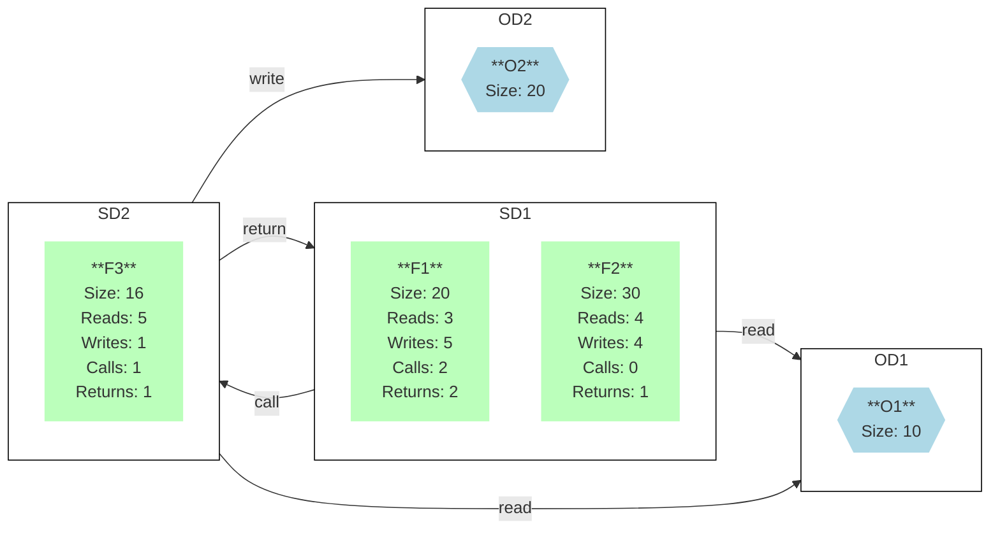

# Privilege Calculator
This repository contains a standalone privilege calculator that calculates privilege metrics for a given system and compartmentalization specification. It operates on compartmentalization specifications provided in the CPM-IF YAML file format (definition available [here](https://github.com/SEVER-PROTECT/CPM-Interchange-Format)).

## Privilege Model
The calculator computes a low-level, instruction and object accessibility based quantification of the privilege permitted by a compartmentalization scheme. It is based on the research papers [uSCOPE](https://www.seas.upenn.edu/~andre/pdf/uscope_raid2021.pdf) and [SCALPEL](https://dl.acm.org/doi/pdf/10.1145/3461673).

In short, one unit of privilege is defined as the ability for one instruction to perform one operation type on one byte of data. For definitions of terms like *Principal*, *Object* and *Subject Domain* see the [CPM IF Specification](https://github.com/SEVER-PROTECT/CPM-Interchange-Format).

The following equation shows how the privilege for one operation type is calculated:

<br>


Where:

*Op* is one of four operation types: read, write, call, and return.

*Principals* is the set of all Principals in the system.

*Objects* is the set of all Objects in the system.

*p.sd.instr_op* is the number of instructions of type *op* inside the Subject Domain belonging to the Principal *p*.

*o.size* is the size in bytes of Object O.

"if *p* can perform *op* on *o*" is defined by a given compartmentalization specification that returns true or false for all triples *(Subject, Operation, Object)* thus defining the allowed permissions of the Compartmentalization.

## Example

### Simple Compartmentalization
To illustrate, we show the calculation for a small example. In this example, there are three functions F1, F2, F3. There are two primitive data entities O1 and O2. F1 and F2 are grouped together into a Subject Domain (SD1) and F3 is alone in SD2. O1 and O2 are each in their own Object Domains, OD1 and OD2. The sizes and number of instructions belonging to each object and function are shown in the diagram below. For simplicity, we assume an empty context and each SD and OD corresponds to a single Principal or Object. Arrows indicate allowed permissions of the labeled operation type.

This compartmentalization scheme represented in the CPM-IF YAML notation can be found at [example.yaml](example.yaml).


### Calculating Privilege of Compartmentalization
Here we show how to calculate the privilege of the compartmentalization. 

*Principal SD1*

Read privilege: (3 + 4) x (10) = 70<br>
Write privilege: (5 + 4) x (0) = 0<br>
Call privilege: (2 + 0) x (20 + 30 + 16) = 132<br>
Return privilege: (2 + 1) x (20 + 30) = 150<br>

*Principal SD2*

Read privilege: (5) x (10) = 50<br>
Write privilege: (1) x (20) = 20<br>
Call privilege: (1) x (16) = 16<br>
Return privilege: (1) x (20 + 30 + 16) = 66<br>

*Total Privilege of Compartmentalization (SD1 + SD2)*:

Read: 120<br>
Write: 20<br>
Call: 148<br>
Return: 216<br>

### Calculating PSR
To calculate the PSR, we must first calculate the monolithic privilege. In the monolithic case, all instructions of each type can access all objects.

*Monolithic Privilege*<br>
Read: (3 + 4 + 5) x (10 + 20) = 360<br>
Write: (5 + 4 + 1) x (10 + 20) = 300<br>
Call: (2 + 0 + 1) x (20 + 30 + 16) = 198<br>
Return: (2 + 1 + 1) x (20 + 30 + 16) = 264<br>

The Privilege Set Ratio (PSR) is defined as the privilege permitted by a compartmentalization divided by the monolithic privilege.

*PSR:*<br>
Read PSR: 120 / 360 = **0.333**<br>
Write PSR: 20 / 300 = **0.067**<br>
Call PSR: 148 / 198 = **0.745**<br>
Return PSR: 216 / 264 = **0.818**<br>
Total PSR: 504 / 1,122 = **0.449**<br>

## Setup and Usage

`calculate_privilege.py` requires the `pyyaml` package. Install it with `pip3 install -r requirements.txt`.

When run on the included `example.yaml` file it produces the same results as our manual calculation:

```
$ python3 calculate_privilege.py example.yaml
PSR:
READ    0.3333333333333333
WRITE   0.06666666666666667
CALL    0.7474747474747475
RETURN  0.8181818181818182
TOTAL   0.44919786096256686
```
